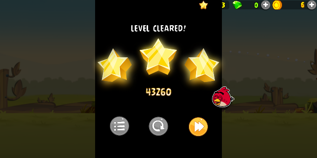
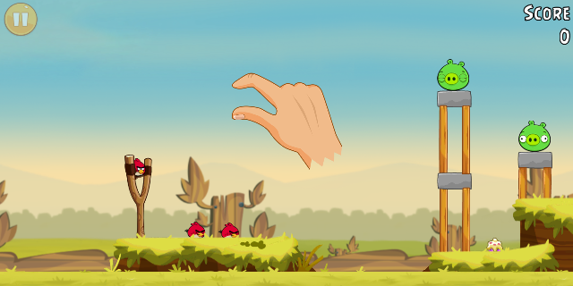

# Angry Birds Classic **8.0.3** → arm64 (Samsung Galaxy A56)

**Runs the original, unmodified Angry Birds Classic 8.0.3 on an AArch64‑only phone that physically
cannot execute the game's 32‑bit ARM code — with every phone‑home and network access removed — via a
fully reproducible, offline Docker pipeline.**

The game plays and wins levels — boot → slingshot physics → level‑complete → next level, on two
Android generations. The APK is authentic (the game code is byte‑for‑byte Rovio's original 8.0.3),
signed for sideload, and installs on modern Android including 16 KB‑page devices.

**Read this before believing the screenshots:** that gameplay was validated with the *same shim
source compiled for x86_64*, in x86_64 Android emulators. **The arm64 APK has not yet been run on
hardware** — an arm64 AVD is impossible on an x86_64 build host, so only the phone can settle it.
Full scope note under [What's verified](#whats-verified).

<p align="center">
  
  
</p>
<p align="center"><em>Left: a level won under the shim on Android 14 (the A56's OS regime). Right: it advances into the next level.<br>
Both from the x86_64 proxy build — see the scope note above. The left image is PROOF_15, produced by a committed script on a
bit‑reproducible binary (<code>3bae8551…</code>), so it can be regenerated rather than taken on trust.</em></p>

---

## The problem this solves

- **The phone.** Samsung Galaxy A56 5G (SM‑A566B), Exynos 1580 — **AArch64‑only**. Its cores have no
  AArch32 EL0 state; they cannot execute 32‑bit ARM instructions *at all*.
- **The game.** Angry Birds Classic 8.0.3's engine is `libAngryBirdsClassic.so` — ~11 MB of **32‑bit
  ARM** native code (plus `libjs.so`, `libadcolony.so`). The APK ships only `armeabi‑v7a` + `x86`;
  there is **no arm64 build**, the engine is game‑specific (nothing to swap in), and Rovio pulled the
  game from the Play Store.
- So it **cannot install or run** on this phone as‑is.

## The approach

Not a decompile‑and‑recompile of 1000+ stripped NEON functions (a genuine fool's errand). Instead:
**run the untouched 32‑bit engine inside an embedded ARM32→ARM64 emulation shim**, loaded natively by
Android's ART as an arm64 `.so` with the same soname the game expects.

- **CPU core:** [Unicorn](https://www.unicorn-engine.org/) (QEMU‑based ARM emulation), 2.1.4, pinned
  to an exact commit.
- **Custom ELF loader** maps the original 32‑bit `.so`; **73** `Java_…`/`JNI_OnLoad` entry points
  marshal the ARM32 AAPCS boundary in both directions.
- **Full bridge layer:** JNI passthrough to the real ART, libc + soft‑float math, GLES2 at native GPU
  speed, EGL/AAsset, file I/O, and a green‑thread scheduler (one Unicorn CPU under a coarse lock) for
  the engine's own pthreads.

The result is loaded by ART like any native library; from Android's point of view it *is* the game.

---

## Download & install

Grab **`angrybirds-8.0.3-arm64.apk`** from the [latest release](../../releases/latest) and sideload it:

```bash
adb install -r angrybirds-8.0.3-arm64.apk        # or copy to the phone and install via the Files app
adb logcat -c && adb logcat -s abshim            # watch the shim boot (see port/ONDEVICE.md)
```

On first launch a one‑time *"built for an older version of Android"* system dialog appears (the APK
targets SDK 26 on purpose — see below); tap through it and play.

> The APK is **self‑signed with a throwaway debug key** — "unsigned" in the sense that matters (not
> Play‑signed, not developer‑signed). Android requires *some* signature to install; a truly unsigned
> APK cannot be installed on any Android device.

## What's verified

Everything reachable without the physical phone has been verified against the **actual shipped bytes**.

> **Scope of the gameplay evidence.** Every play‑validation below was produced by the *same shim
> source compiled for x86_64*, running in x86_64 Android emulators — the run logs all show the
> engine loading from `lib/x86_64/libengine32.so`. **The arm64 APK itself has never been executed
> on hardware**; it is built, signed, aligned and statically audited. An arm64 AVD is impossible on
> an x86_64 host (the emulator refuses: *"Avd's CPU Architecture 'arm64' is not supported by the
> QEMU2 emulator on x86_64 host"*), so an end‑to‑end arm64 run genuinely requires the device.
> Unicorn runs the ARM32 guest faithfully on both hosts — 125/125 C++ constructors execute clean
> on each, and the guest's allocation sequence is now **byte‑for‑byte identical** between them:
> all **7793** records — same order, same sizes, same call sites — same sha256 on x86 and
> AArch64 (`port/validation/alloc_trace_compare.sh`). The older *"7792 of 7793 match"* figure
> was measured before the allocator size‑class fix; that one divergent allocation is now gone.
> This is still *"both hosts run the guest identically"*, **not** *"the arm64 APK runs"* — the
> latter needs the device. See `port/validation/README.md`.

| | Status |
|---|---|
| **Plays & wins** *(x86 proxy)* | boots → auto‑loads the tutorial → slingshot drag launches the bird on a correct Box2D arc → collapses the pig structure → scores → **"LEVEL CLEARED"** → advances into the next level. Screenshot‑proven (`reports/shots/PROOF_*.png`). |
| **Three Android generations, including the phone's own** *(x86 emulators)* | full playthrough + win on **Android 7.1 (API 25)**, **Android 14 (API 34)** and **Android 16 (API 36) — the A56's actual OS version, with Google Play Services present**. Multi‑level progression and save persistence validated on API 36 too. Testing on API 36 is not ceremony: it exposed an Android‑16‑only fullscreen dialog that swallows every touch until dismissed, which `port/ONDEVICE.md` now warns about. |
| **Authentic** | the bundled engine, `libjs`, `libadcolony`, and `classes.dex` are **byte‑for‑byte identical** to the original 8.0.3 APK (SHA‑256 checked). The game code is unmodified — only the manifest is de‑permissioned and the native lib is the shim wrapping the untouched engine. |
| **Installs on modern Android** | targetSdk 26 → installs with plain `pm install`; Unicorn's JIT executes all 125 C++ constructors under **W^X** (targetSdk < 29 keeps writable+executable memory permitted); links **`libm`** (modern bionic needs it explicitly); ELF LOAD segments are **16 KB‑page aligned** so it `dlopen`s on 16 KB‑page devices as well as 4 KB. |
| **No phone‑home** | four independent layers (below). The app has no INTERNET permission and the shipped shim **imports no socket symbols at all** (`socket`/`connect`/`sendto`/`recvfrom`/`getaddrinfo` are absent from its dynamic symbols), so there is no socket capability in the binary to reach. Note the emulator runs are `--network none`, so they demonstrate the *mechanisms*, not observed-and-blocked traffic. |
| **Reproducible** | bit‑for‑bit identical rebuilds; the toolchain is version‑pinned and the full image→APK rebuild reproduces the exact deliverable (proven). |

What only the physical A56 can settle: **that the arm64 build runs at all** (see the scope note
above), plus real‑time frame‑rate and the real Mali/Xclipse
GPU's shader‑compile path (the validation emulators use software SwiftShader). `port/ONDEVICE.md`
maps every `abshim` log line to a diagnosis so one `adb logcat` pinpoints anything device‑specific.

## No phone‑homes / no internet — four independent layers

1. **OS:** `android.permission.INTERNET` (and network‑state, accounts, billing, the C2DM/push family,
   Play install‑referrer) are renamed to invalid same‑length strings in the binary manifest → the
   kernel **refuses every socket** the app opens. Analytics, ads, crash reports, Facebook, cloud —
   all dead.
2. **libc:** the shim hard‑fails `socket`/`connect`/`send`/`recv`/`getaddrinfo` for the emulated
   engine (defense in depth).
3. **Manifest components:** billing / accounts / push / install‑referrer declarations neutralized.
4. **Auto‑collecting SDKs, disabled at the source:** injected `<meta-data>` flags turn off Firebase
   Cloud Messaging auto‑registration (the one phone‑home the missing INTERNET permission can't stop,
   since Google Play Services does that network *for* the app) and Facebook local event collection.

**All four layers are verified at runtime, on Android 16 — the phone's own OS version.** Layer 4 needed a Google Play Services emulator to
test at all (`Dockerfile.ab-emu-gms`), because FCM registration is done by GMS *for* the app and
so survives the missing INTERNET permission. `emu_layer4_fcm_test.sh` proves it differentially:
the same build with the kill‑switch **removed** attempts token registration, the shipped build
attempts it **zero** times. See `port/OPEN_FINDINGS.md`.

Native Flurry / Rovio‑BI still gather data **locally**, but it is **sendless** — layer 1 denies every
socket, so nothing collected can ever leave the device. (What you actually see in `logcat` is the bundled SDK's own resolver reading `/etc/hosts`
over and over — 1851 times in one measured playthrough — plus `[net] l_socket -> hard-fail
(de-phone-home)` when it tries to open a socket. The `UnknownHostException` lines in a full
`logcat` belong to the **system's** NetworkMonitor on a different pid, not to this app: a
measured run attributes **zero** name-resolution or socket activity to the app's own pid, and
`emu_jni_exception_probe.sh` asserts that by pid. See `port/ONDEVICE.md`.)

## Reproduce it yourself (fully offline conversion)

```bash
bash port/reproduce.sh
```

This (0) decompresses the committed 8.0.3 input APK and verifies its SHA‑256, (1) builds the pinned
toolchain image (**NDK r26d + Unicorn 2.1.4 at a fixed commit** — the *only* step that touches the
network, outbound‑only, no ports), (2) converts the 32‑bit APK → arm64‑v8a **inside
`docker run --network none`**, and (3) verifies the signature + alignment. Full details in
`port/REPRODUCE.md`; on‑device install/triage in `port/ONDEVICE.md`.

**Sovereign & reproducible:** the input APK, the entire shim source, the build scripts, the pinned
Dockerfiles, and the fixed debug key are all committed here, so the deliverable can be regenerated
byte‑for‑byte from this repository alone — no external state.

## Repository layout

```
apks/com.rovio.angrybirds@8.0.3.apk.xz   the authentic 8.0.3 input (xz‑compressed; SHA‑256 0580c3d3…)
port/shim/src/                            the emulation shim (C) — loader, Unicorn CPU, bridges, scheduler
port/build_apk.sh                         the reproducible 32‑bit→arm64 conversion (ABSHIM_AUDIO=1 for the audio variant)
port/docker/Dockerfile.ab-port            the pinned toolchain image (NDK r26d + Unicorn 2.1.4)
port/depermission.py, manifest_firebase_off.py   the de‑phone‑home surgery
port/debug.ks                             the fixed throwaway signing key (reproducible signature)
port/reproduce.sh, REPRODUCE.md, ONDEVICE.md      one‑command build, build guide, install/triage guide
port/validate_all.sh                      one command for every offline check: host suite,
                                          the same tests on AArch64, and the claim verifier
port/prepare_inputs.sh                    decompresses + sha256‑gates the input every build script needs
port/validation/                          the emulator rig that produced every PROOF — scripts, README,
                                          and the recorded reproducible proxy hashes
port/validation/verify_claims.sh          re‑checks all 18 documented claims against the shipped bytes;
                                          exits non‑zero if any is false (run by reproduce.sh step 3)
port/shim/test/run_tests.sh               host test suite + the coverage hard‑gate (0 unbridged imports)
reports/shots/PROOF_*.png                 screenshot evidence
```

Build **outputs** (`out/…apk`) and large research artifacts are intentionally not tracked —
everything regenerates from `reproduce.sh`, byte‑for‑byte. (There is currently **no GitHub
release**; `RELEASE_NOTES.md` is prepared and carries the publish commands plus the current
SHA‑256s.)

## Optional: audio‑enabled variant

The default APK is **silent** (the audio mixer is a no‑op) — that's the fully‑validated shipped build.
An experimental audio build (`ABSHIM_AUDIO=1 bash port/build_apk.sh` → `…-arm64-audio.apk`, also a
release asset) is validated **crash‑free and plays+wins a level with audio active** on API 25 and 34.
What can't be settled off‑device is *continuous* playback: the validation emulator's own host audio
backend won't initialize headless, so the AudioTrack buffer never drains — an emulator limitation,
not a shim bug; the A56's real audio hardware drains it. See `port/ONDEVICE.md` to try it.

---

## License & copyright

- **The port** — the ARM32→ARM64 shim, the build pipeline, the de‑phone‑home tooling, and all
  original code and documentation in this repository — © 2026 **Ronen Zyroff**, licensed under the
  **GNU GPL v2** (see `LICENSE`). GPLv2 applies because the shim statically links Unicorn (GPLv2);
  the full corresponding source is this repository. See `NOTICE`.
- **Angry Birds Classic** — the game itself (the bundled APK, its engine, assets, and Java code) is
  **© Rovio Entertainment Corporation**, included **unmodified** for personal archival and
  interoperability. This project is **not affiliated with, authorized, or endorsed by Rovio**. All
  Angry Birds trademarks belong to Rovio.

---

## Release notes — v1.0.0

First official release of the arm64 port of Angry Birds Classic 8.0.3 for AArch64‑only devices
(target: Samsung Galaxy A56 / Exynos 1580).

**Highlights**
- Original 32‑bit engine runs unmodified inside an ARM32→ARM64 Unicorn shim, loaded natively by ART.
- **Plays and wins** — full slingshot/Box2D physics, level‑complete, and multi‑level progression,
  screenshot‑proven on Android 7.1 (API 25) and Android 14 (API 34) — **on the x86_64 proxy
  build**; the arm64 APK has not yet been run on hardware.
- **Installs on modern Android**, including **16 KB‑page devices** (16 KB‑aligned ELF), with `libm`
  linked and Unicorn's JIT running under W^X (targetSdk 26).
- **De‑phone‑home** — four independent layers; no INTERNET permission, and the shim imports no
  socket symbols at all. Verified against the shipped bytes by `port/validation/verify_claims.sh`.
- **Authentic** — game code byte‑for‑byte identical to Rovio's original 8.0.3.
- **Reproducible** — bit‑identical builds from a version‑pinned toolchain; the whole image→APK
  pipeline reproduces the exact deliverable.
- Experimental **audio** variant (crash‑free, plays with audio; continuous playback pending on‑device).

**Assets**
- `angrybirds-8.0.3-arm64.apk` — the deliverable (silent, fully validated). Sideload and play.
- `angrybirds-8.0.3-arm64-audio.apk` — experimental audio‑enabled variant.

**Known limitation (needs the physical device):** real‑time performance under the emulation lock and
the real Mali/Xclipse GPU shader path. Send `adb logcat -s abshim` from the A56 to iterate.
